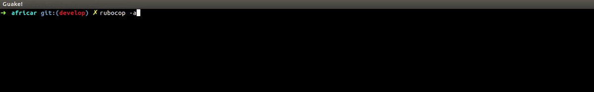

# Linters congiguration

## Why we use linters?
Lint is a tool that analyze source code to flag programming errors, bugs, stylistic errors, and suspicious constructs. So we dont need to spend time for code syntax checking, linters can do it for us. 
## Linters libraries
* [Rubocop](https://github.com/rubocop-hq/rubocop)
* [ES-lint](https://github.com/eslint/eslint)
* [SCSS-lint](https://github.com/brigade/scss-lint)
* [Slim-lint](https://github.com/sds/slim-lint)
* [Overcommit](https://github.com/brigade/overcommit)
## Rubocop
[Rubocop](https://github.com/rubocop-hq/rubocop) is a Ruby static code analyzer and formatter, based on the community Ruby style guide

RuboCop is extremely flexible and most aspects of its behavior can be tweaked via various configuration options.
### Installation

```sh
gem install rubocop
```
If you'd rather install RuboCop using bundler, don't require it in your Gemfile:
```ruby
gem 'rubocop', require: false
```
[Rubocop config example](configs/.rubocop.yml)
## Es Lint 
[ES-lint](https://github.com/eslint/eslint) is a fully pluggable tool for identifying and reporting on patterns in JavaScript
### Installation
If you want to include ESLint as part of your project's build system, we recommend installing it locally. You can do so using npm:
```sh
npm install eslint --save-dev
```
You should then set up a configuration file:
```sh
$ ./node_modules/.bin/eslint --init
```
After that, you can run ESLint on any file or directory like this:
```sh
./node_modules/.bin/eslint yourfile.js
```
## SCSS-lint 
[SCSS-lint](https://github.com/brigade/scss-lint) is a configurable tool for writing clean and consistent SCSS
### Installation
Add to your Gemfile
```ruby
gem 'scss_lint'
```
After that, you can run SCSS-lint on any file or directory like this:
```sh
scss-lint app/assets/stylesheets/
```
or
```sh
scss-lint app/assets/stylesheets/**/*.css.scss
```
[SCSS-lint config example](configs/.scss-lint.yml)

## Slim-lint 
[Slim-lint](https://github.com/sds/slim-lint) is a configurable tool for analyzing Slim templates
### Installation
Add to your Gemfile
```ruby
gem 'slim_lint'
```
Run slim-lint from the command line by passing in a directory (or multiple directories) to recursively scan:
```sh
slim-lint app/views/
```
[Slim-lint config example](configs/.slim-lint.yml)

## Overcommit
[Overcommit](https://github.com/brigade/overcommit) is a fully configurable and extendable Git hook manager

### Installation
Overcommit is installed via RubyGems. It is strongly recommended that your environment support running gem install without requiring sudo privileges. Using a Ruby version manager like rbenv or rvm can help here.
```sh
gem install overcommit
```
You can then run the overcommit command to install hooks into repositories.
```sh
mkdir important-project
cd important-project
git init
overcommit --install
```
[Overcommit config example](configs/.overcommit.yml)
## License
Copyright © 2015-2018 Codica. It is released under the [MIT License](https://opensource.org/licenses/MIT).

## About Codica

[](https://www.codica.com)

We love open source software! See [our other projects](https://github.com/codica2) or [hire us](https://www.codica.com/) to design, develop, and grow your product.